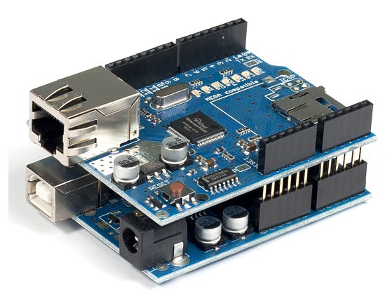
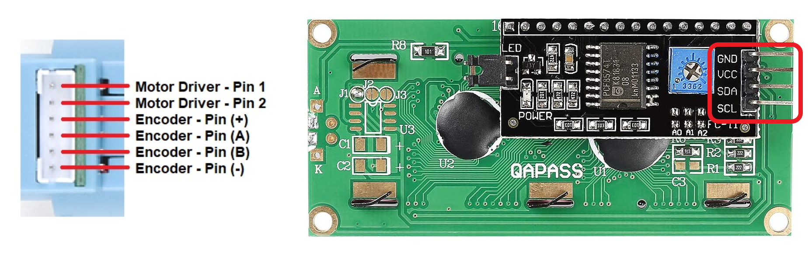
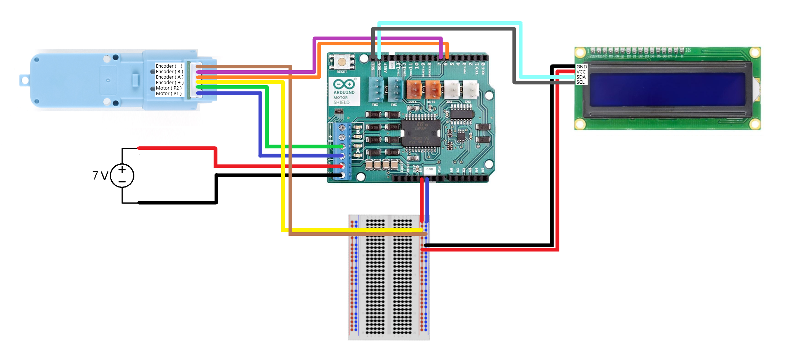
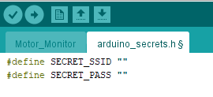
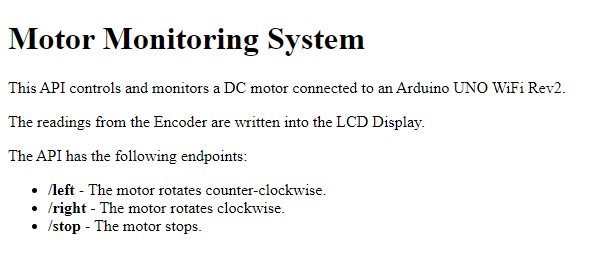

# DC-Motor-Monitor 💽

This project was created during my time as a student at Code Chrysalis for Polyglottal Week.

DC motors are a common choice for a wide variety of projects due to their low cost, high torque and easiness of control. There is even a whole selection of gearboxes for achieving different speeds! However, it might be a little difficult to keep track of the current angular position because they rotate very fast. 

Luckily for us, lots of motors in the market now come with Encoders! These additional devices provide us with a way to know the motor's position during and after rotation. And how cool would it be to be able to control and monitor it through your reliable local network? Accordingly, today's system is made up of a DC motor with Encoder controlled by an Arduino board with a Java interface connected to Wi-Fi.

## Hardware 📋

Here is a list of the actual components we used for the physical part of this project. You might opt not to use exactly the same parts, so feel free to take this list as a point of reference.

- [Arduino UNO WIFI Rev2](https://store-usa.arduino.cc/collections/boards/products/arduino-uno-wifi-rev2)
- [Arduino Motor Shield Rev3](https://store-usa.arduino.cc/products/arduino-motor-shield-rev3)
- [I2C 1602a LCD Display](https://www.amazon.co.jp/-/en/SunFounder-Serial-Module-Display-Arduino/dp/B08X21LKP2)
- [Hobby Motor with Encoder - Metal Gear](https://www.sparkfun.com/products/16413)
- [7V Voltage Source](https://www.amazon.co.jp/gp/product/B0798JTWTD)
- [Breadboard](https://www.amazon.co.jp/gp/product/B06ZZSB77C/)

## Connections 🔗

Before we start with the wiring there is some preliminary work we need to do first:

1. The **Arduino Motor Shield Rev3** is an add-on for the **Arduino UNO WIFI Rev2** to control DC motors and other similar electrical devices, so they should be mounted together like in the image below:
 
All the connections will be done on the available ports of the **Arduino Motor Shield Rev3**. You can find more information about Arduino shields [here](https://www.dummies.com/computers/arduino/an-overview-of-arduino-shields/).
2. Identify the pins on your devices. The pin location may vary from device to device, so we recommend taking a look at the corresponding datasheets of your parts. The pins you need for this project are the following:
 

Now that we have everything in sight, we can procede to do the wiring as specified below:

 

> **Warning!** 
The **Arduino UNO WIFI Rev2** can be powered either through the USB connection or through the specified pins in the **Arduino Motor Shield Rev3. 
*DO NOT CONNECT BOTH AT THE SAME TIME!*** This may cause severe damage to your devices. In order to minimize the risk, we also recommend using a 6~9V DC Motor and a 7V power source.
> 

## Building ⚒️

1. Fork and clone this repository.
2. Upload the sketch `./Motor_Monitor/Motor_Monitor.ino` into your Arduino board.
    1. Make sure the power source from the **Arduino Motor Shield Rev3** is disconnected.
    2. Connect the **Arduino UNO WIFI Rev2** to your computer using a A-B USB cable.
    3. Open the sketch in **Arduino Software IDE**. For more information click [here](https://www.arduino.cc/en/Guide).
    4. Configure your Arduino board and the port being used on your computer.
    5. Create an `arduino_secrets.h` file and include your Wi-Fi connection credentials. 
     
    6. Upload the code to your Arduino board with the *"Upload"* button.
    7. Verify the output on the LCD Display.
    8. You can also check the application by typing the IP address in your web browser. 
     
    9. Disconnect the USB cable, reconnect the **Arduino Motor Shield Rev3** power source and re-check the output on the LCD Display.
3. Import the project from `./Motor_Panel/` into your workspace.
    1. Open your **Eclipse IDE** Workspace. For more information click [here](https://www.eclipse.org/getting_started/).
    2. Import the contents from `./Motor_Panel/` as *"Existing Projects into Workspace".*
    3. Verify the contents from the `motor.panel.project` package.

## Instructions of Use 🔛

1. Connect the **Arduino Motor Shield Rev3** power source.
2. Verify the IP address on the LCD Display. That is the address of your application on your local Wi-Fi network. You will need this information for connecting the interface.
3. Run the Java interface.
    1. **From Eclipse IDE:** Run the project as a *"Java Application"*.
    2. **From the Command Prompt:**
        1. Verify your *Java* version with the following command:
        Insert Command here
        2. If not installed, you can get it from [here](https://www.oracle.com/java/technologies/downloads/).
        3. We prepared an executable you can with the following commands:
        Insert Commands here
4. Connect to your application by typing the previous IP address and clicking *"Connect"*.
5. Test the interface's **Left**, **Right** and **Stop** buttons and check the motor's movement and position reading on the LCD Display.

If things seem to go south, you can always restart the application by pressing the *"Reset"* button on the **Arduino Motor Shield Rev3.** Reconnect the interface just if the IP address happens to be different from before. And don't forget to have fun!

## Future Improvements 📈

- [ ]  Add connection validation functionalities.
- [ ]  Being able to pass user-defined speed data to the server.
- [ ]  Implement PID control to the motor.
- [ ]  Connect the motor (or motors) to a more complex device.

## Conclusions 📕

Even when simple in shape, this project is a combination of technologies widely used in real-world applications. It has an interface that can communicate through the internet with a server that controls a motor on a physical space. We see this as a starting point for more complex, internet connected applications, and is something we feel particularly proud of.